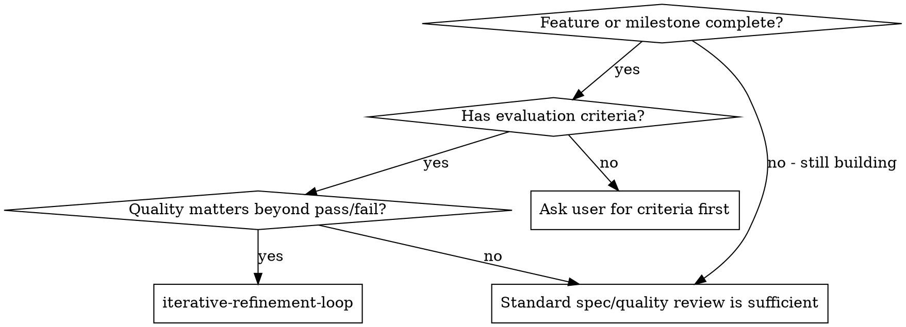
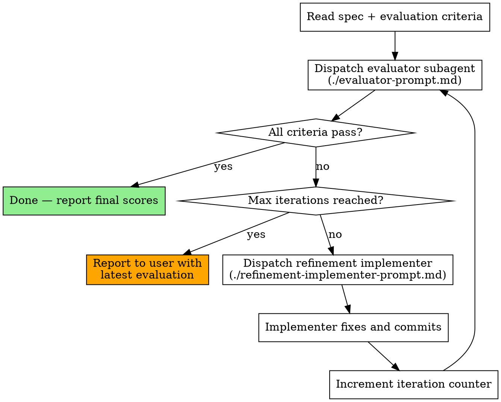

# Iterative Refinement Loop

A generate→evaluate→feedback loop that drives implementation quality upward through multiple rounds, inspired by the GAN-inspired pattern from Anthropic's harness design research.

**Core principle:** Separate generation from evaluation. A fresh evaluator with no attachment to the code catches what self-review misses. Feed its critique back to a fresh implementer. Repeat until criteria pass.

**When this differs from spec/quality review:** Spec review is a gate — did you build what was asked? Quality review is a gate — is the code clean? This skill is a **refinement driver** — is the result *good enough* against explicit criteria? It catches the gap between "technically correct" and "actually excellent."

## When to Use



**Use when:**
- Integrated feature is complete but quality bar is high
- Work involves subjective judgment (design, UX, architecture aesthetics)
- Complex integration where issues only emerge from holistic review
- User has provided evaluation criteria or acceptance standards
- You want to iterate toward "excellent," not just "correct"

**Don't use when:**
- Individual tasks during implementation (use spec/quality review)
- Simple, mechanical changes
- No evaluation criteria exist (ask the user first)

## Prerequisites

Before starting this loop, you need:
1. **Completed implementation** — the feature works at a basic level
2. **Evaluation criteria** — provided by the user. These are the standards the evaluator grades against. Without criteria, the evaluator has nothing concrete to be skeptical about.
3. **The spec or plan** — so the evaluator knows what was intended
4. **A way to verify** — tests, manual steps, or commands the evaluator can reference

## The Loop



## Configuration

| Setting | Default | Notes |
|---------|---------|-------|
| Max iterations | 3 | Prevents infinite loops. Increase for subjective/creative work. |
| Pass threshold | All criteria pass the user-defined bar | User defines what "pass" means per criterion. |

## Running the Loop

### Step 1: Gather Inputs

Before dispatching the evaluator, assemble:
- **Spec/plan path** — what was supposed to be built
- **Evaluation criteria** — the user's grading standards (text, checklist, or scoring rubric)
- **Relevant file paths** — what the evaluator should read
- **Verification commands** — tests or steps the evaluator can reference

### Step 2: Dispatch Evaluator

Use the evaluator prompt template (./evaluator-prompt.md). The evaluator:
- Reads the spec and the implementation independently
- Grades each criterion with a score and detailed explanation
- Lists every specific issue (file, line, description)
- Provides an overall PASS/FAIL verdict

**Critical: the evaluator must be skeptical by default.** The prompt encodes this. Do not soften it.

### Step 3: Check Results

- If all criteria pass → **done**. Report the final scores and move on.
- If max iterations reached → **stop**. Report the current state to the user with the evaluator's latest assessment. The user decides whether to continue, adjust criteria, or accept.
- Otherwise → proceed to Step 4.

### Step 4: Dispatch Refinement Implementer

Use the refinement implementer prompt template (./refinement-implementer-prompt.md). The implementer:
- Receives the evaluator's full critique
- Makes a **strategic decision**: refine the current approach, or pivot to a different one
- Implements fixes, commits, and reports what changed

### Step 5: Loop Back

Increment iteration counter and return to Step 2.

## Iteration Tracking

Track loop state in a structured format (session memory or inline):

```
## Refinement Loop: [Feature Name]
- Iteration: 2 / 3 max
- Last evaluation: FAIL (2/4 criteria passing)
- Criteria scores: [Functionality: PASS, Design: FAIL, Completeness: FAIL, Code Quality: PASS]
- Trend: Functionality improved from FAIL→PASS; Design unchanged
- Evaluator's top issues: [list]
```

This gives visibility into whether the loop is making progress or plateauing.

## When the Loop Stalls

If scores stop improving between iterations:
- The implementer may be hitting the limits of what it can fix without broader changes
- Report to the user with the evaluator's latest assessment
- The user may need to: adjust criteria, provide more specific guidance, or accept current quality

**Do not continue looping** if two consecutive iterations show no improvement on any criterion. That's a signal to escalate, not retry.

## Integration with Other Skills

This skill plugs into the existing workflow at specific points:

**After subagent-driven-development completes all tasks:**
```
subagent-driven-development (all tasks) 
  → iterative-refinement-loop (holistic quality refinement)
  → finishing-a-development-branch
```

**After executing-plans completes:**
```
executing-plans (all tasks)
  → iterative-refinement-loop
  → finishing-a-development-branch
```

**Standalone (user triggers manually):**
The user asks to evaluate and refine existing work against criteria.

## Prompt Templates

- `./evaluator-prompt.md` — Dispatch skeptical evaluator subagent
- `./refinement-implementer-prompt.md` — Dispatch implementer that acts on evaluator feedback
